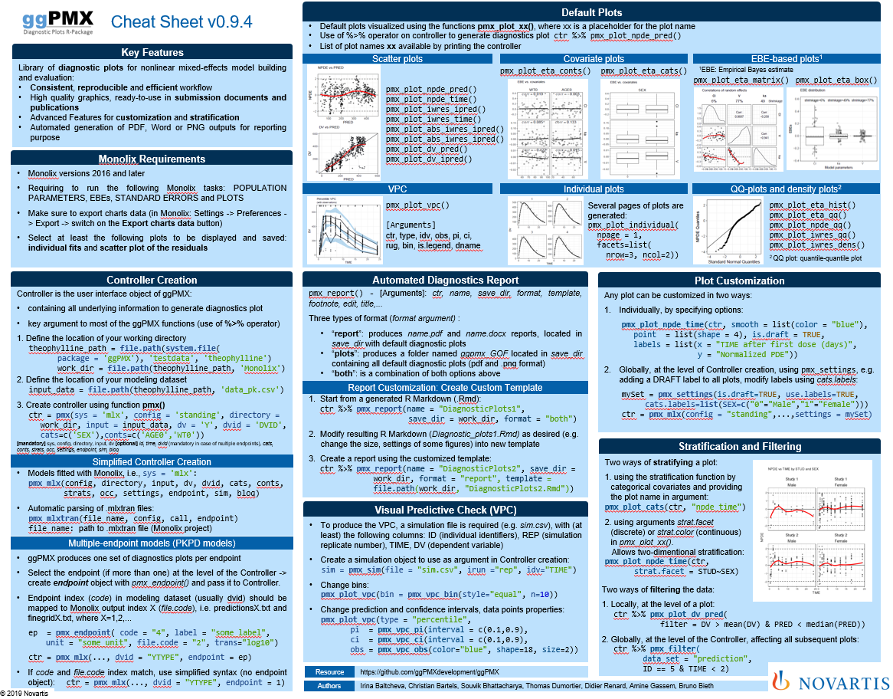

<!-- README.md is generated from README.Rmd. Please edit that file -->


# ggPMX 

**Authors**:  Amine Gassem, Irina Baltcheva, Christian Bartels, Thomas Dumortier, Seid Hamzic, Souvik Bhattacharya, Inga Ludwig, Ines Paule, Didier Renard, Bruno Bieth

[](https://github.com/ggPMXdevelopment/ggPMX/actions)
[](https://cran.r-project.org/package=ggPMX)
[](https://codecov.io/gh/ggPMXdevelopment/ggPMX)
[](https://cran.r-project.org/package=ggPMX)
[](https://www.rdocumentation.org/packages/ggPMX)


# Overview

ggPMX is an open-source R package freely available on CRAN since April 2019. It generates standard diagnostic plots for mixed effect models used in pharmacometric activities. The package builds on the R-package ggplot2 and aims at providing a workflow that is **consistent**, **reproducible** and **efficient**, resulting in **high quality graphics** ready-to-use in submission documents and publications. Intuitive functions and options allow for optimal figure customization and graphics stratification. ggPMX enables straightforward generation of PDF, Word or PNG output files that contain all diagnostic plots for keeping track of modeling results. The package is currently compatible with Monolix versions 2016 and later, NONMEM version 7.2 and later and nlmixr.

Using simple syntax, the toolbox produces various goodness-of-fit diagnostics such as:
- residual- and empirical Bayes estimate (EBE)-based plots, 
- distribution plots, 
- prediction- and simulation-based diagnostics (visual predictive checks). 

In addition, shrinkage and summary parameters tables can be also produced. By default, the PDF- or Word-format diagnostic report contains essential goodness-of-fit plots. However, these can be adapted to produce different sets of diagnostics as desired by the user, and any of the plots may be customized individually. The types of supported customizations include modifications of the graphical parameters, labels, and various stratifications by covariates.

# Installation


```r

# Either install from CRAN
install.packages("ggPMX")
# Or the development version from GitHub:
# install.packages("devtools")
devtools::install_github("ggPMXdevelopment/ggPMX")
```

# Testing the install

Once ggPMX is installed, you can test if everything is working well.  If successful you should see a plot created after the following build-in example.

```R
library(ggPMX)
ctr <- theophylline()
ctr %>% pmx_plot_eta_matrix()
```


# Cheatsheet




# Feedback

ggPMX is now ready for inputs and enhancements by the pharmacometric community.
- Please use [ package issues](https://github.com/ggPMXdevelopment/ggPMX/issues) to fill in your feedback.


\clearpage  

```
#> Error in library(ggPMX): there is no package called 'ggPMX'
#> Error in theophylline(): could not find function "theophylline"
```


# Introduction 
The `ggPMX` package generates standard diagnostic plots and tables for mixed effect models used in Pharmacometric (PMX) activities. The tool is built upon the ggplot2 package and supports models developped with Monolix, NONMEM and nlmixr software. The current release (1.2) supports models fitted with Monolix versions 2016 and later, NONMEM version 7.2 and later and nlmixr.

The package aims to provide a workflow that is consistent, efficient and which results in high quality graphics ready to use in official documents and reports. The package allows a high degree of flexibility and customization, yet providing an acceptable default setting. The package also allows to fully automate plots and report generation. 

The general context is the analysis of mixed effect models fitted to data. ggPMX was developed in the framework of Pharmacometric activities, in which case the model is a population pharmacokinetic (PK) and/or pharmacodynamic (PD) model and the data is clinical or pre-clinical PK and/or PD data.

In the context of model building, evaluation and qualification, it is good practice to assess the goodness-of-fit of models by inspecting (qualitatively and quantitatively) a set of graphs that indicate how well the model describes the data. Several types of diagnostic plots allow to evaluate a mixed effects model fit, the most common being:

a. residual-based plots
b. prediction-based plots
c. empirical Bayes estimates (EBE)-based plots
d. simulation-based plots.

The following figures are examples of diagnotic plots. 

```
#> Error in theophylline(): could not find function "theophylline"
#> Error in ctr %>% pmx_plot_dv_pred: could not find function "%>%"
#> Error in ctr %>% pmx_plot_npde_time: could not find function "%>%"
#> Error in ctr %>% pmx_plot_vpc: could not find function "%>%"
#> Error in ctr %>% pmx_plot_eta_box: could not find function "%>%"
#> Error in ctr %>% pmx_plot_eta_matrix(shrink = list(size = 3, hjust = 1.5)): could not find function "%>%"
```

This document introduces the ggPMX functionalities and syntax. 

## Architecture 

The high level architecture is represented in the figure below. The key components of the package are the following:

* **Reader** - reads model outputs from different sources (i.e. text files containing population parameters, model predictions, individual random effects, simulations and data-related inputs like covariates) and restructures these outputs into standard formats for internal processing.
* **Generator** ??? processes outputs from Reader. It contains R language code to produce the plots and is factorized into a small set of flexible key functions.  A set of default plots is defined in a configuration file. The configuration file can be adapted, e.g., to have different configurations for different types of modeling activities. 
* **Controller** - serves as user interface. The user will call Generator functions via wrapper functions in the Controller to produce either all the default plots or selected plots of interest. In addition to editing the configuration, the user has different options to adapt aspects of the plots to specific requirements. Plots may be adapted by setting parameters of the wrapper functions that generate the plots; there exist additional wrapper functions to change aspects of the existing default plots. The plots are, in general, returned as ggplot objects that can be further customized using ggplot functionalities. 
* **Reporter** - generates sets of graphs and tables and integrates them into an output file (Word or PDF) with annotations.


The package is coded using object-oriented programming meaning that information is encoded in objects. The user can change or print the content of objets via functions. Such an implementation allows to have code that is modular and easily customizable. 

## Workflow overview

The typical workflow of ggPMX is as follows:

1. The user creates the Controller using pre-defined configurations (yaml templates) for plot settings.
2. The Controller implicitly calls the Reader that reads and stores modelling outputs into a standard format. As a result, the Controller contains all available plots with their default values according to the configuration used.
3. The Generator allows to print the available plots by calling the corresponding functions. Plots can be modified by using optional arguments.
4. A call to the Reporter allows to create a pdf or docx report. The report Rmarkdown template can also be personalized.

The most important task for the user is the Controller creation. This step requires careful consideration because it involves different options according to the type of model (PK or PKPD) and software (Monolix, NONMEM or nlmixr) used for model fitting. The next section describes the Controller creation for the different possible cases.

Once the Controller is created, it implicitly calls the Reader and creates the diagnostic plots. The user can then generate the graphs by calling pre-defined functions. The same syntax is used independent of the model structure (PK or PKPD model) and of the fitting software.

The Reporter creates one report per endpoint, i.e., one report for PK and one for each PD endpoint. 

## Modeling datasets

For the sake of this document, three types of datasets are defined.

* The *input modeling dataset* is the one used for model fitting (the actual data). There are no particular requirements regarding this dataset.
* The *output modeling datasets* are those output from the fitting tool (Monolix, NONMEM or nlmixr). See the appendix for more details on software requirements.
* The *ggPMX datasets* are the ones created within (internal to) ggPMX. 


# Controller
A diagnostic session starts with the creation of a Controller. The Controller is the "user interface" of the package and allows to conrol all possible options. It is a container that stores configuration fields (model- and input data-related information), datasets and plots. It can be used as a reference object in which the user can see the names of the exisitng plots, the names of the `ggPMX` datasets, etc. The syntax of the Controller creation differs depending on the software used for model fitting and on the number of model endpoints (or outputs). This section presents different cases of Controller creation. For simplicity, the case of models with one single output is presented first, then generalized to several outputs.
## Single-endpoint models

In general, models with only one endpoint (or output) are mostly PK models, but these could also be k-PD models. 

To illustrate `ggPMX` functionalities, the single-endpoint built-in model called **theophylline** is used hereafter. The **theophylline** population PK example has the following characteristics:

- The input modeling data contains PK samples of 2 studies, each with 25 individuals who recieved a unique dose of 2000 mg theophylline. 
- The model is a simple one-compartmental PK model with first-order absorption. 
- The following covariates are used: weight (WT0) on volume (V) and clearance (Cl), age (AGE0), sex (SEX) and study (STUD) on clearance. 
- Random effects on all three parameters (ka, Cl, V) are included. 
- The residual error is proportional.

The input modeling dataset has the following columns:

```
#> Error in file(file, "rt"): cannot open the connection
#> Error in head(input_data_theo): object 'input_data_theo' not found
```
Note that the DVID (or CMT/YTYPE) column is missing, but since this is a single-endpoint model, it is not necessary in that case.

\begin{table}[ht]
\centering
\begin{tabular}{rlll}
  \hline
 & Argument & Description & Values \\ 
  \hline
1 & sys & Software used for model fittng (Monolix or nlmixr) & mlx, mlx2018, nm \\ 
  2 & config & A pre-defined configuration is a set of default settings & standing \\ 
  3 & directory & Path to the directory containing model output files &  \\ 
  4 & input & Path to input modeling dataset (dataset used for model fitting) &  \\ 
  5 & dv & Measurable variable name, as defined in the input modeling dataset & DV, LIDV, LNDV, Y, etc. \\ 
  6 & dvid & Endpoint (output) name, as defined in the input modeling dataset & DVID, YTYPE, CMT, etc. \\ 
   \hline
\end{tabular}
\caption{Mandatory arguments of pmx() function} 
\label{tab:pmx_mandatory}
\end{table}

## Controller creation

The Contoller creation is wrapped in a function called "theophylline()" for quick reference:

```r
ctr <- theophylline()
#> Error in theophylline(): could not find function "theophylline"
```

### Models fitted with Monolix (versions 2016 and later) 

####`pmx_mlx()`

The controller initialization using the Monolix controller `pmx_mlx()`, which is a wrapper function for `pmx()` with `sys="mlx"` (See Appendix A).

```r
theophylline_path <- file.path(system.file(package = "ggPMX"), "testdata", "theophylline")
work_dir          <- file.path(theophylline_path, "Monolix")
input_data_path   <- file.path(theophylline_path, "data_pk.csv")

ctr <- pmx_mlx(
  directory = work_dir,
  input     = input_data_path,
  dv        = "Y"
)
```

####`pmx_mlxtran()`

The controller initialization can be simplified by using the Monolix controller `pmx_mlxtran()`. This function parses the mlxtran file of a Monolix project and assigns automatically the different fields necessary to the Controller creation. The only mandatory argument is file_name, the path to the mlxtran file.

```r
mlxtran_path <- file.path(system.file(package = "ggPMX"), 
                          "testdata", "1_popPK_model", "project.mlxtran")

ctr <- pmx_mlxtran(file_name = mlxtran_path)
```
The user can verify the content of the Controller and how parameters are assigned by printing it. 


### Models fitted with NONMEM (versions 7.2 and later) 

####`pmx_nm()`

The controller initialization using the NONMEM controller `pmx_nm()` is based on reading functions of the xpose package.
It is highly recommended (but not required) to use the "sdtab, patab, cotab, catab" table naming convention followed by a run number (e.g. sdtab001,cotab001)
This will enable automatic recognition of covariates. It is also recommended to name the model files accordingly (e.g. run001.lst). 
In order to generate a VPC a simulation dataset is required (see section about VPC)

For controller generation it is recommended to use the model file:

```r
nonmem_dir <- file.path(system.file(package = "ggPMX"), "testdata","extdata")
ctr <- pmx_nm(
  directory = nonmem_dir,
  file     = "run001.lst" 
)
```

or the run number. The standard prefix is "run", however can be specified using `prefix`

```r
nonmem_dir <- file.path(system.file(package = "ggPMX"), "testdata","extdata")
ctr <- pmx_nm(
  directory = nonmem_dir,
  runno     = "001" #can be a string or a number
)
```


### Models fitted with nlmixr

####`pmx_nlmixr()`

It is simple to create a ggPMX controller for a nlmixr object using `pmx_nlmixr()`.
Using the theophylline example with a nlmixr model we have:


```r
one.cmt <- function() {
  ini({
    ## You may label each parameter with a comment
    tka <- 0.45 # Log Ka
    tcl <- 1 # Log Cl
    ## This works with interactive models
    ## You may also label the preceding line with label("label text")
    tv <- 3.45; label("log V")
    ## the label("Label name") works with all models
    eta.ka ~ 0.6
    eta.cl ~ 0.3
    eta.v ~ 0.1
    add.sd <- 0.7
  })
  model({
    ka <- exp(tka + eta.ka)
    cl <- exp(tcl + eta.cl)
    v <- exp(tv + eta.v)
    linCmt() ~ add(add.sd)
  })
}

fit <- nlmixr(one.cmt, theo_sd, est="saem", control=list(print=0))
```

The `fit` object is a nlmixr fit; You can read it into the nlmixr controller by:


```r
ctr <- pmx_nlmixr(fit, 
                  vpc = FALSE ## VPC is turned on by default, can turn off
)
```

### Optional arguments for controller creation

The following are some optional arguments to the controller function (for details of each option, see the corresponding section or use `?pmx_mlx`, `?pmx_nm`, `?pmx_nlmixr`):

* cats: character vector of categorical covariates
* conts: character vector of continuous covariates
* occ: character occasinal covariate variable name (currently not available for NONMEM or nlmixr)
* strats: character extra stratification variables
* settings: global pmxSettingsClass (`pmx_settings()`) shared between all plots
* endpoint: pmxEndpointClass (`pmx_endpoint()`) or integer or charcater of the endpoint code (depends on the fitting software)
* sim: pmxSimClass object for VPC generation. (syntax for VPC generation is depending on the fitting software)


## Multiple-endpoint models

Models with more than one endpoint (or output) are mostly PKPD models, but these could also be, for example, PK binding models in which there are measurements and predictions of both PK and its target.

ggPMX produces one diagnostics report per endpoint. As a consequence, the endpoint (if more than one) should be set at the time of the Controller creation in order to filter the observations dataset and to keep only the values corresponding to the endpoint of interest. There are two ways of dealing with endpoints, using pmx_endpoint() (only for Monolix), or a simplified syntax for endpoints which is supported by all software outputs.

### Using pmx_endpoint() (only for Monolix)

To handle this, the user creates an "endpoint" object using the function `pmx_endpoint()` having the following attributes:

- **code** (charcater): how the endpoint is coded in the input (modeling) dataset
- **label**: can be used in the title of some plots or for the report file name
- **unit**: used in the axis label for some plots
- **files** (list): `list(predictions="predictions1",finegrid ="finegrid1")` 
- **trans**: whether the value must be transformed before being displayed and which transformation to use.

To illustrate the Controller creation with multiple-endpoint models, a built-in PKPD example is used. The input dataset is called pk_pd.csv and has the following columns.


```
#> Error in file(file, "rt"): cannot open the connection
#> [1] "/testdata/theophylline/data_pk.csv"
```

The dvid column contains values=3 for PK (first endpoint) and dose and =4 for PD (second endpoint). Monolix2016 outputs are found in folder RESULTS/ which contains predictions1.txt and finegrid1.txt for PK predictions, and predictions2.txt and finegrid2.txt for PD predictions. The Endpoint and Controller objects are created as follows:

```r
pkpd_path       <- file.path(system.file(package = "ggPMX"), "testdata", "pk_pd")
pkpd_work_dir   <- file.path(pkpd_path, "RESULTS")
pkpd_input_file <- file.path(pkpd_path, "pk_pd.csv")

ep <- pmx_endpoint(
  code  = "4",
  label = "some_label",
  unit  = "some_unit",
  file.code = "2", # will use predictions2.txt and finegrig2.txt
  trans = "log10"
)
#> Error in pmx_endpoint(code = "4", label = "some_label", unit = "some_unit", : could not find function "pmx_endpoint"

ctr <- pmx_mlx(
  directory = pkpd_work_dir,
  input     = pkpd_input_file,
  dv        = "dv",
  dvid      = "dvid",
  endpoint  = ep
)
#> Error in pmx_mlx(directory = pkpd_work_dir, input = pkpd_input_file, dv = "dv", : could not find function "pmx_mlx"
```

### A simplified syntax for endpoints (for Monolix, NONMEM and nlmixr)
For NONMEM and nlmixr users, endpoint can be simply specified  in the controller creation by e.g. `endpoint = 1`

NONMEM

```r
ctr <- pmx_nm(
  directory = nonmem_dir,
  file     = "run001.lst",
  endpoint = 1 ## select the first endpoint 
  dvid = "DVID" ## use this column as observation id 
)
```

nlmixr

```r
ctr <- pmx_nlmixr(fit, 
                  endpoint = 1 ## select the first endpoint 
                  dvid = "DVID" ## use this column as observation id 
)
```

Also for Monolix users, a simplified syntax for the Endpoint creation exists in the case where the endpoint code matches the files post-fixes (code=1 corresponds to predictions1.txt, code=2 corresponds to predictions2.txt). Instead of passing a pmxEndpoint object as argument of the Controller, the user can specify the numerical value corresponding to the YTYPE/CMT/DVID column.

```r
pmx_mlx(
  dvid = "YTYPE", ## use this column as observation id 
  endpoint = 1,   ## select the first endpoint 
  ...)            ## other pmx parameters , config, input,etc..
```
Internally, a pmxEndpoint object will be created, and observations having YTYPE=x will be filtered.  

## Controller with covariates

Besides the mandatory fields to initialize a Controller, the user can set optional parameters related to covariates. This feature is illustrated below with the Theophylline example.


```r
theophylline_path <- file.path(system.file(package = "ggPMX"), "testdata", "theophylline")
work_dir          <- file.path(theophylline_path, "Monolix")
input_data_path   <- file.path(theophylline_path, "data_pk.csv")

ctr <- pmx_mlx(
  directory = work_dir,
  input     = input_data_path,
  dv        = "Y",
  cats      = c("SEX"),
  conts     = c("WT0", "AGE0"),
  strats    = c("STUD", "SEX")
)
#> Error in pmx_mlx(directory = work_dir, input = input_data_path, dv = "Y", : could not find function "pmx_mlx"
```
`Conts` are the continuous covariates. `Cats` are categorical covariates used in the model, whereas `strats` are categorical variables that can be used for plot stratification, but are not used as covariates in the model.

The covariates can be accessed using helper functions:


```r
ctr %>% get_cats()
#> Error in ctr %>% get_cats(): could not find function "%>%"
ctr %>% get_conts()
#> Error in ctr %>% get_conts(): could not find function "%>%"
ctr %>% get_strats()
#> Error in ctr %>% get_strats(): could not find function "%>%"
ctr %>% get_covariates()
#> Error in ctr %>% get_covariates(): could not find function "%>%"
```


## Controller content
The content of the Controller can be seen by printing it:

```r
ctr
#> Error in eval(expr, envir, enclos): object 'ctr' not found
```

It contains three tables:

- The first table is the Controller configuration. The user can see the working directory, the input modeling dataset name, the dependent variable (DV) name and other fields related to the model (e.g., continuous and discrete covariates).

- The second table lists the `ggPMX` datasets. The first column (`data_name`) of this table contains the ggPMX name of the dataset; the second column (data_file) contains the names of the output modeling datasets (for example estimates.txt); in the third column (data_label) contains the dataset description.

- The third table provides the list of available plots in the Generator. It corresponds to Table \ref{tab:plots_list}.


### Plot names

The Controller is a container that stores all plots. To get the list of plots, the function `plot_names()` is used:

```r
ctr %>% plot_names()
#> Error in ctr %>% plot_names(): could not find function "%>%"
```
An alternative way to display the names of the existing plots is by printing the content of the Controller as done above.

`ggPMX` provides a specialized function to create and update each plot `pmx_plot_xx()` where `xx` is the plot name from the list above. 

### Plot types

Each plot type is a class of similar plots. `ggPMX` defines the following plot types:

  + SCATTER: residual plots
  + IND: individual plots display longitudinal (time course) predictions and data (one panel per individual)
  + DIS: distribution of empirical Bayes estimates (EBE) histogram or boxplot
  + ETA_PAIRS: random effects (ETA) distributions and correlations structure
  + ETA_COV: relationships between random effects (ETA) and continuous or categorical covariates
  + PMX_QQ: quantile-quantile plot (qq-plot)

The following syntax allows to see which type of plot corresponds to which plot name:

```r
ctr %>% plots()
#> Error in ctr %>% plots(): could not find function "%>%"
```

\begin{table}[ht]
\centering
\begin{tabular}{rll}
  \hline
 & ggPMX dataset & Description \\ 
  \hline
1 & input & Input modeling dataset \\ 
  2 & estimates & Estimated population parameters \\ 
  3 & eta & Random effects, their standard deviation and residual errors (to calculate shrinkage) \\ 
  4 & predictions & Observations and predictions at times of observations dataset \\ 
  5 & finegrid & Additional predictions (at times without observations) \\ 
   \hline
\end{tabular}
\caption{ggPMX datasets} 
\label{tab:ggPMX_datasets}
\end{table}

# Default diagnostic plots

```
#> Error in theophylline(): could not find function "theophylline"
```

The diagnostic plots of ggPMX are generated by calling the functions `pmx_plot_xx()` where `xx` is a placeholder for the plot name. The list of names of all available plots can be seen via:

```r
ctr %>% plot_names()
#> Error in ctr %>% plot_names(): could not find function "%>%"
```

As a convention, when plots are described as ???Y vs. X???, it is meant that Y is plotted on the vertical axis and X on the horizontal axis.

As an example, a plot of individual weighted residuals (IWRES) versus time (with default settings) can be generated using a single-line code:

```r
ctr %>% pmx_plot_iwres_time
#> Error in ctr %>% pmx_plot_iwres_time: could not find function "%>%"
```

The complete list of available plots per plot type (given in parenthesis) is given below:

- Residual plots (**SCATTER**)

```r
ctr %>% pmx_plot_dv_pred
ctr %>% pmx_plot_dv_ipred

ctr %>% pmx_plot_iwres_time
ctr %>% pmx_plot_npde_time

ctr %>% pmx_plot_iwres_ipred
ctr %>% pmx_plot_abs_iwres_ipred

ctr %>% pmx_plot_npde_pred
```

- Empirical Bayes Estimates (EBE), also called "eta", histogram and boxplot (**DIS**)

```r
ctr %>% pmx_plot_eta_hist
ctr %>% pmx_plot_eta_box
```

- Individual plots (**IND**)

```r
ctr %>% pmx_plot_individual(which_pages = 1)
```

- QQ-plots (**PMX_QQ**)

```r
ctr %>% pmx_plot_npde_qq
ctr %>% pmx_plot_iwres_qq
```

- Distribution and correlation structure of random effects (**ETA_PAIRS**)

```r
ctr %>% pmx_plot_eta_matrix
```

# Visual Predictive Checks (VPC)

## Initialization

In order to generate VPCs a simulation dataset is requried. Creation of VPC is slightly different dependening on the fitting software used (Monolix, NONMEM or nlmixr).

### Models fitted with Monolix (versions 2016 and later) 

Monolix users, need to run a simulation with simulx. Here's an example code


```r
## Create simulated object using simulx
mysim <- simulx(project=project_dir, nrep=100) #
## Retrieve simulated dataset (assumed to be in y1)
simdata <- mysim$LIDV
```

For use with ggPMX, it is required that the IDs are reverted to the original IDs as in the modelling dataset for ggPMX.


```r
## Need to revert the original IDs as in modeling dataset for ggPMX
## Rename IDs column to same name as in modeling dataset, e.g.
## ???id??? in the example below
simdata <- simdata %>% 
  mutate(newId = as.numeric(as.character(id))) %>%
  left_join(., mysim$originalId) %>%
  mutate(id = as.numeric(as.character(oriId))) %>%
  select(-oriId, -newId) %>%
  data.table::data.table()

## It's highly recommended to store your simulation as .csv
vpc_file <- write.csv(simdata, file = "my_VPC.csv", quote=FALSE, row.names = FALSE)
```

`pmx_sim` creates a simulation object. It takes the following arguments:

Argumentss

1. **file**	character path to the simulation file
2. **irun**	character name of the simulation column
3. **idv**	character name of the ind. variable
4. **dv**	character name of the observation variable


Within pmx vpc controller, it is called like : 


```r

theoph_path <- file.path(
  system.file(package = "ggPMX"), "testdata",
  "theophylline"
)
WORK_DIR <- file.path(theoph_path, "Monolix")
input_file <- file.path(theoph_path, "data_pk.csv")
vpc_file <- file.path(theoph_path, "sim.csv")

ctr <- pmx_mlx(
  directory = WORK_DIR,
  input = input_file,
  dv = "Y",
  cats = c("SEX"),
  conts = c("WT0", "AGE0"),
  strats = "STUD",
  settings = pmx_settings(
    use.labels=TRUE,
    cats.labels=list(
      SEX=c("0"="Male","1"="Female")
    )
  ),
  sim = pmx_sim(
    file = vpc_file,
    irun ="rep",
    idv="TIME"
  )
)
#> Error in pmx_mlx(directory = WORK_DIR, input = input_file, dv = "Y", cats = c("SEX"), : could not find function "pmx_mlx"
```

### Models fitted with NONMEM (versions 7.2 and later) 

It is required to provide simulation tables to generate VPCs. Furthermore, it is highly recommended that simulation tables have a "sim"-suffix and are kept with the same naming convetion as for the prediction tables (e.g sdtab001sim, catab001sim)). In this case they're automatically recognized by the runnumber (runno) or by the model file if specified there. For post-hoc simulation it is possible to include an additional simfile:


```r
ctr <- pmx_nm(
  directory = model_dir,
  file      = "modelfile.ctl" #or .lst
  simfile   = "simulation_modelfile.ctl" #or .lst
)
```

Important: When simulations are performed post-hoc and the controller is generated by run number, the reader might load the wrong .ext file (used for parameters). A warning message is displayed.

### Models fitted with nlmixr

For nlmixr users, the VPC is generated automatically with the controller creation and turned on by default `vpc = TRUE`.


```r
ctr <- pmx_nlmixr(fit) ## VPC will be generated automatically, vpc = TRUE

ctr <- pmx_nlmixr(fit, 
                  vpc = FALSE ## But can be turned off
)
```

## VPC plot

The plot options are described in `?pmx_plot_vpc` function. 

### Default


```r
ctr %>% pmx_plot_vpc
#> Error in ctr %>% pmx_plot_vpc: could not find function "%>%"
```

### Scatter/Percentile

By default the vpc plot is **percentile** ; , but we can plot the **scatter** type:

```r
ctr %>% pmx_plot_vpc(type ="scatter")
#> Error in ctr %>% pmx_plot_vpc(type = "scatter"): could not find function "%>%"
```

### Binning


```r
ctr %>% pmx_plot_vpc(bin=pmx_vpc_bin(style = "kmeans",n=5))
#> Error in ctr %>% pmx_plot_vpc(bin = pmx_vpc_bin(style = "kmeans", n = 5)): could not find function "%>%"
```

### Stratification 


```r
ctr %>% pmx_plot_vpc(strat.facet="SEX",facets=list(nrow=2))
#> Error in ctr %>% pmx_plot_vpc(strat.facet = "SEX", facets = list(nrow = 2)): could not find function "%>%"
```

### Monolix-like customisation

User can customize the options to get a Monolix-like display.


```r
ctr %>% pmx_plot_vpc(
  strat.facet="SEX",
  facets=list(nrow=2),
  type="percentile",
  is.draft = FALSE,
  pi = pmx_vpc_pi(interval = c(0.1,0.9),
              median=list(color="green"),
              extreme= list(color="green")),
  obs = pmx_vpc_obs(color="blue",shape=18,size=2),
  ci = pmx_vpc_ci(interval = c(0.1,0.9),
              median=list(fill="red"))
)
#> Error in ctr %>% pmx_plot_vpc(strat.facet = "SEX", facets = list(nrow = 2), : could not find function "%>%"
```


# Diagnostics report

```
#> Error in theophylline(): could not find function "theophylline"
```

A report (in pdf and docx format) containing all default diagnostic plots can be created using the *pmx_report* function. The *format* can take three different values:

- "report": produces a pdf and a docx file (named `name.pdf` and `name.png` specified in argument *name*, located in *save_dir*) with default diagnostic plots
- "plots": produces a folder named `ggpmx_GOF` located in *save_dir* that contains all default diagnotic plots, each in a pdf and png file. The different plots are numerated in order to have an unique identifier for each plot (ex: ebe_box-1.pdf). This is necessary for having correct footnotes that indicated the path to the source file (for submission reports).
- "both": is a combination of both options above.

Example:

```r
ctr %>% pmx_report(name='Diagnostic_plots2',
                   save_dir = work_dir,
                   format='both')
```

Note that running the same command first with the option "format='plots'" and then with the option "format='report'" will remove the *ggpmx_GOF* folder. 

Note also that by default, the report will have the DRAFT label on all plots. The label can be removed by using the settings argument in the Controller creation.

The user can customize the default report by creating a "template". To create a template, the user should create first a default report with the following command:

```r
ctr %>% pmx_report(name='Diagnostic_plots1',
                   save_dir = work_dir,
                   format='report')
```
The Rmarkdown (.Rmd) file is the "template". The user can modify the Rmarkdown file as desired (ex: changing the size of some figures) and save the modified file. The new template can be used with the following command:

```r
ctr %>% pmx_report(name='Diagnostic_plots3',
                   save_dir = work_dir,
                   format='report',
                   template=file.path(work_dir,'Diagnostic_plots1.Rmd'))
```


# Customizing plots
Any particular plot can be customized in two ways:

-	Specifying options in each call of a plot (on the fly, recommended): 

```r
ctr %>% pmx_plot_xx(list of options)
```

-	Customizing a type of plot for all subsequent calls in the session by modifying the Controller:

```r
ctr %>% pmx_update(???xx???, list of options)
```

Help(pmx_gpar) lists some options. 

Help(pmx_plot_xx) lists some possible parameters to update a particular plot. 

To obtain an exhaustive list of possible options for a particular plot, use the following:

```r
ctr %>% get_plot_config("xx")
```

## Visualization of BLQs (Monolix and NONMEM)
It is possible to visualize BLQ (below the limit of quantification) values in the individual plots.
For this, `bloq` needs to be specified using the pmx_bloq function (see example below with the `pmx_mlxtran()` function).

```r
ctr %>% pmx_mlxtran(file_name = mlx_file, bloq=pmx_bloq(cens = ???BLQ???, limit = ???LIMIT???))
ctr %>% pmx_plot_individual()
```

## Simulated BLOQ (Monolix 2018 and later)

Monolix users may want to plot simulated BLQs. This is possible for outputs with Monolix 2018 and later.
An additional dataset is loaded (sim_blq), which will be used for plotting insted the regular "predictions"-dataset.

The `sim_blq` statment can be specified within the plot (locally) ...

```r
ctr %>% pmx_mlxtran(file_name = mlx_file))
ctr %>% pmx_plot_iwres_ipred(sim_blq = TRUE)
```

... or within the controller (globally).
If this statment is used within the controller, all corresponding plots will plot simulated BLOQs by default.

```r
ctr %>% pmx_mlxtran(file_name = mlx_file, sim_blq = TRUE))
ctr %>% pmx_plot_iwres_ipred()
```


## Customizing global settings - `pmx_settings()`

The user can define a Controller with global settings that will be applied to all plots. For example remove draft annoataion, use abbreviation defintions to define axis labels, etc. 

A settings object is defined by using the function `pmx_settings()`. The created object is passed as the parameter "settings" to `pmx()`. By doing so, the settings are defined globally and apply to all plots. For a complete list of global settings with their corresponding default values, please consult the ggPMX Help (`?pmx_settings`).


```r

## set one or more settings
my_settings <- pmx_settings(
  is.draft   = FALSE,
  use.abbrev = TRUE,
  ...) ### set other settings parameters here 
ctr <-
  pmx_mlx(
    ..., ## put here other pmx parametes 
    settings = my_settings
  ) 
```


### Remove DRAFT label globally 

By default in the "standing" configuration, a DRAFT label is printed on all plots. In order to switch this label off, the user sets the `is.draft` option of `pmx_settings()` to `FALSE`.


```r

ctr <- theophylline(settings = pmx_settings(is.draft = FALSE))
#> Error in theophylline(settings = pmx_settings(is.draft = FALSE)): could not find function "theophylline"
```


### Use abbreviation definitions 

The standing configuration initializes all plots using abbreviations for axis labels. Each abbreviation has its corresponding definition. To get the list of abbreviation : 


```r
ctr %>% get_abbrev
#> Error in ctr %>% get_abbrev: could not find function "%>%"
```
You can update one abbreviation to set a custom label 


```r
ctr %>% set_abbrev(TIME="TIME after the first dose")
#> Error in ctr %>% set_abbrev(TIME = "TIME after the first dose"): could not find function "%>%"
```

Using `use.abbrev` flag you can use abbreviation definition to set axis labels:


```r
ctr <- theophylline(settings=pmx_settings(use.abbrev = TRUE))
#> Error in theophylline(settings = pmx_settings(use.abbrev = TRUE)): could not find function "theophylline"
ctr %>% set_abbrev(TIME="Custom TIME axis")
#> Error in ctr %>% set_abbrev(TIME = "Custom TIME axis"): could not find function "%>%"
ctr %>% pmx_plot_npde_time
#> Error in ctr %>% pmx_plot_npde_time: could not find function "%>%"
```

### Use `finegrid.txt` file for individual plots

within Monolix, user can choose to not use finegrid file even if it is present. 


```r
ctr <- theophylline()
#> Error in theophylline(): could not find function "theophylline"
ctr %>% pmx_plot_individual(use.finegrid =FALSE, legend.position="top")
#> Error in ctr %>% pmx_plot_individual(use.finegrid = FALSE, legend.position = "top"): could not find function "%>%"
```

### Set stratification color legend

In case of color startfication user can customize the legend. For example here using the `ggplot2::scale_color_manual`:


```r
ctr <- theophylline()
#> Error in theophylline(): could not find function "theophylline"
ctr %>% pmx_plot_npde_time(strat.color="STUD")+ 
      ggplot2::scale_color_manual(
        "Study",
        labels=c("Study 1","Study 2"),
        values=c("1"="green","2"="blue"))
#> Error in ctr %>% pmx_plot_npde_time(strat.color = "STUD"): could not find function "%>%"
```

Another way to do it is to define a global `scales.color` parameter that will applied to all plots with strat.color :

```r

ctr <- theophylline(
  settings=
    pmx_settings(
      color.scales=list(
        "Study",
        labels=c("Study 1","Study 2"),
        values=c("1"="orange","2"="magenta"))
    )
)
#> Error in theophylline(settings = pmx_settings(color.scales = list("Study", : could not find function "theophylline"

ctr %>% pmx_plot_npde_time(strat.color="STUD")
#> Error in ctr %>% pmx_plot_npde_time(strat.color = "STUD"): could not find function "%>%"
```


```r
ctr %>% pmx_plot_eta_box(strat.color="STUD")
#> Error in ctr %>% pmx_plot_eta_box(strat.color = "STUD"): could not find function "%>%"
```


### Define labels of categorical variables

In case of faceting by stratification user can redfine categorical labels to have more human readables strips. Lables are defined within `cats.labels` argument and user can use them by setting `use.lables` to TRUE.


```r


ctr <- theophylline(
  settings=
    pmx_settings(
      cats.labels=list(
        SEX=c("0"="M","1"="F"),
        STUD=c("1"="Study 1","2"="Study 2")
      ),
      use.labels = TRUE
    )
)
#> Error in theophylline(settings = pmx_settings(cats.labels = list(SEX = c(`0` = "M", : could not find function "theophylline"

ctr %>% pmx_plot_npde_time(strat.facet=~SEX)
#> Error in ctr %>% pmx_plot_npde_time(strat.facet = ~SEX): could not find function "%>%"
```


```r


ctr <- theophylline(
  settings=
    pmx_settings(
      cats.labels=list(
        SEX=c("0"="M","1"="F"),
        STUD=c("1"="Study 1","2"="Study 2")
      ),
      use.labels = TRUE
    )
)
#> Error in theophylline(settings = pmx_settings(cats.labels = list(SEX = c(`0` = "M", : could not find function "theophylline"

ctr %>% pmx_plot_npde_time(strat.facet=~SEX)
#> Error in ctr %>% pmx_plot_npde_time(strat.facet = ~SEX): could not find function "%>%"
```


```r
ctr %>% pmx_plot_eta_box(strat.facet =~SEX)
#> Error in ctr %>% pmx_plot_eta_box(strat.facet = ~SEX): could not find function "%>%"
```


# Appendix

## Generic Controller creation with `pmx()`

The function `pmx()` is the generic function for greating a Controller. The user needs to specify a set of arguments such as the path to the model directory, the software used for model fitting (Monolix or nlmixr), the name of a configuration. A list of all existing configurations is provided in the Appendix. All **mandatory** arguments of `pmx()` are listed in Table \ref{tab:pmx_mandatory}.

The example below defines a Controller with the *standing* (standard) configuration. 

```r
theophylline_path <- file.path(system.file(package = "ggPMX"), "testdata", "theophylline")
work_dir          <- file.path(theophylline_path, "Monolix")
input_data_path   <- file.path(theophylline_path, "data_pk.csv")

ctr <- pmx(
  sys       = "mlx",
  config    = "standing",
  directory = work_dir,
  input     = input_data_path,
  dv        = "Y",
  dvid      = "DVID"
)
#> Error in pmx(sys = "mlx", config = "standing", directory = work_dir, input = input_data_path, : could not find function "pmx"
```
Note that the column "DVID" of data_pk.csv does not exist; however it is not needed here because there is only one single output of the model. As dvid is a mandatory argument, it still needs to be provided and was set arbritrarly to "DVID" in the example above. 

The input dataset can be provided to ggPMX via its location (as in the example above) or as a data frame (maybe give an example). The modeling output datasets have to be in the location that is indicated as working directory (`work_dir` in the example above).


## Software requirements

ggPMX is compatible with Monolix versions 2016 and later, NONMEM version 7.2 and later, and nlmixr.

### Monolix

In order to be able to produce all available diagnostic plots, the following tasks should be executed in Monolix during the model fitting procedure:

* Population parameters;
* Individual parameters (EBEs);
* Standard errors;
* Plots.

In addition, make sure to export charts data (In Monolix 2018: Settings -> Preferences -> Export -> switch on the Export charts data button).
Select at least the following plots to be displayed and saved: individual fits and scatter plot of the residuals.

### NONMEM

NONMEM Version 7.2/7.3/7.4
Preferred output tables according ???sdtab, patab, cotab, catab??? convention
Simulation are required for creation of VPC (e.g. sdtab1sim)

### nlmixr

Fit objects need to be generated by nlmixr and have data attached.
Standard errors are required (a successful covariance plot) for full diagnostic checks. Can use `boostrapFit()` to get standard error estimates if necessary


## Plots table

The main target of ggPMX is to create a report containing the following plots (see abbreviation list below): 

\begin{table}[ht]
\centering
\begin{tabular}{rlll}
  \hline
 & Plot Name & ggPMX type & ggPMX name \\ 
  \hline
1 & Scatter plot of NPDE vs population predictions & SCATTER & npde\_pred \\ 
  2 & Scatter plot of NPDE vs time & SCATTER & npde\_time \\ 
  3 & Scatter plot of IWRES vs time & SCATTER & iwres\_time \\ 
  4 & Scatter plot of observations vs population predictions & SCATTER & dv\_pred \\ 
  5 & Scatter plot of observations vs individual predictions & SCATTER & dv\_ipred \\ 
  6 & Scatter plot of absolute value of IWRES vs individual predictions & SCATTER & abs\_iwres\_ipred \\ 
  7 & Scatter plot of IWRES vs individual predictions & SCATTER & iwres\_ipred \\ 
  8 & Plots of observations and model predictions per individual & IND & individual \\ 
  9 & Histogram of EBE & DIS & ebe\_hist \\ 
  10 & Boxplot of EBE & DIS & ebe\_box \\ 
  11 & Distribution and quantile-quantile plot of IWRES & QQ & qq\_iwres \\ 
  12 & Distribution and correlation structure of RE (`ETA`) & ETA\_PAIRS & eta\_matrix \\ 
  13 & Relationships between RE and categorical covariates & ETA\_COV & eta\_cats \\ 
  14 & Relationships between RE and continuous covariates & ETA\_COV & eta\_conts \\ 
  15 & Visual predictive check (VPC) & VPC & vpc \\ 
   \hline
\end{tabular}
\caption{List of all diagnostic plots} 
\label{tab:plots_list}
\end{table}
Abbreviations:

- NPDE: normalized prediction distribution errors
- IWRES: individual weighted residuals
- EBE: empirical Bayes estimates
- RE: random effects
- VPC: visual predivtive check

## ggPMX main functions

`ggPMX` implements few functions to generate and manipulate diagnostic plots. 
(Should we list pmx and pmx_mlx separately and say the differences? Or it's maybe clear from the previous sections.)

\begin{table}[ht]
\centering
\begin{tabular}{rlll}
  \hline
 &   & Function name & Description \\ 
  \hline
1 & 1 & pmx, or pmx\_mlx & Creates a controller \\ 
  2 & 2 & plot\_names or plots & Lists controller plots \\ 
  3 & 3 & get\_data & Lists controller data \\ 
  4 & 4 & get\_plot & Prints a plot \\ 
  5 & 5 & set\_plot & Creates a new plot \\ 
  6 & 6 & pmx\_update & Updates an existing plot \\ 
  7 & 7 & pmx\_filter & Filters globally the data of the current session \\ 
  8 & 8 & pmx\_copy & Returns a deep copy of the controller \\ 
   \hline
\end{tabular}
\caption{List of all `ggPMX` functions} 
\label{tab:func_list}
\end{table}

(Apparently, it's not the full list. Add all functions.)
The design of the package is around the central object: the controller. It can introspected or piped using the `%>%` operand. 

**Note that**:

The controller is an `R6` object, it behaves like a reference object.  Some functions (methods) can have a side effect on the controller and modify it internally. Technically speaking we talk about chaining not piping here. However, using `pmx_copy` user can work on a copy of the controller.


## ggPMX graphical parameters 

Graphical parameters in `ggPMX` are set internally using the `pmx_gpar` function. A number of graphical parameters can be set for the different plot types. 


```r
args(pmx_gpar)
#> Error in args(pmx_gpar): object 'pmx_gpar' not found
```
More information can be found in the help document `?pmx_gpar` and in the examples that follow.

## Pre-defined configurations

For the moment we are mainly using standing configuration. In the next release user can specfiy configuration either by cretaing a custom yaml file or an R configuration object. Also ggPMX will create many helper functions to manipulate the configuration objects.


## Shrinkage

## Default call

The shrinkage is a computation within controller data. In general it is used to annotate the plots. Although one can get it independently from any plot using `pmx_comp_shrink`. It is part of the `pmx_compt_xx` layer( In the future we will add , `pmx_comp_cor` , `pmx_comp_summary`,..)

Here the basic call:


```r
ctr %>% pmx_comp_shrink
#> Error in ctr %>% pmx_comp_shrink: could not find function "%>%"
```


We get the shrinkage for each effect (**SHRINK** column).

The same values can be shown on distribution plot , for example  : 


```r
ctr %>% pmx_plot_eta_box
#> Error in ctr %>% pmx_plot_eta_box: could not find function "%>%"
```
or : 

```r
ctr %>% pmx_plot_eta_hist
#> Error in ctr %>% pmx_plot_eta_hist: could not find function "%>%"
```

You can add or remove shrinkage annotation using `is.shrink` argument ( TRUE by default) : 


```r
ctr %>%   pmx_plot_eta_box( is.shrink = FALSE) 
#> Error in ctr %>% pmx_plot_eta_box(is.shrink = FALSE): could not find function "%>%"
```


## Var function

You can compute shrinkage by applying either standard deviation `sd` or variance `var` : 

```r
ctr %>% pmx_comp_shrink(  fun = "var")
#> Error in ctr %>% pmx_comp_shrink(fun = "var"): could not find function "%>%"
```


```r
ctr %>% pmx_plot_eta_box( shrink=list(fun = "var"))
#> Error in ctr %>% pmx_plot_eta_box(shrink = list(fun = "var")): could not find function "%>%"
```
 
 
## Shrinkage and stratification

Shrinkage can be applied after stratification :


```r
ctr %>% pmx_comp_shrink(strat.facet = ~SEX)
#> Error in ctr %>% pmx_comp_shrink(strat.facet = ~SEX): could not find function "%>%"
```
or by grouping like : 


```r
ctr %>% pmx_comp_shrink(strat.color = "SEX")
#> Error in ctr %>% pmx_comp_shrink(strat.color = "SEX"): could not find function "%>%"
```

We can 

```r
ctr %>% pmx_plot_eta_hist(is.shrink = TRUE, strat.facet = ~SEX,
                          facets=list(scales="free_y"))
#> Error in ctr %>% pmx_plot_eta_hist(is.shrink = TRUE, strat.facet = ~SEX, : could not find function "%>%"
```
or 
 

```r
ctr %>% pmx_plot_eta_box(is.shrink = TRUE, strat.facet = "SEX",
                          facets=list(scales="free_y",ncol=2))
#> Error in ctr %>% pmx_plot_eta_box(is.shrink = TRUE, strat.facet = "SEX", : could not find function "%>%"
```

